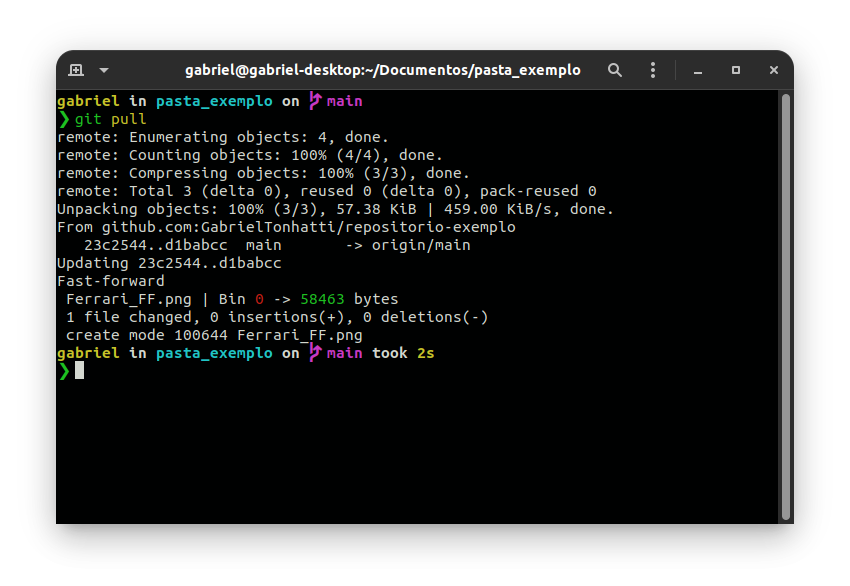
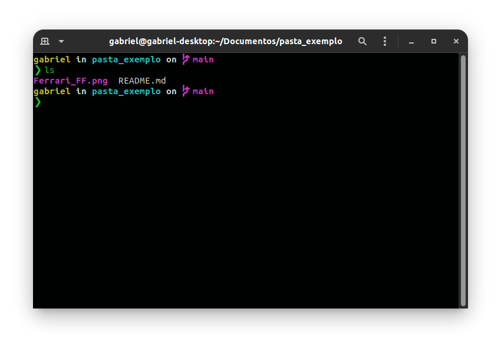

###### Obs: Informações tiradas do site: <a href = "https://www.atlassian.com/br/git/tutorials/what-is-git#performance">Bitbucket </a>.

<a href = "#sobre">Sobre</a> | <a href = "#instalacao">Instação</a> | <a href = "#configuracao">Configuração</a> | <a href = "#comandos">Comandos</a>

<p id ="sobre">

# O que é Git

<a href = "#desempenho">Desempenho </a> |  <a href = "#seguranca">Segurança</a> | <a href = "#flexibilidade">Flexibilidade</a> | <a href = "#controle">Controle de versões com Git</a>

De longe, o sistema de controle de versão moderno mais usado no mundo hoje é o Git. O Git é um projeto de código aberto maduro e com manutenção ativa desenvolvido em 2005 por Linus Torvalds, o famoso criador do kernel do sistema operacional Linux. Um número impressionante de projetos de software depende do Git para controle de versão, incluindo projetos comerciais e de código-fonte aberto. Os desenvolvedores que trabalharam com o Git estão bem representados no pool de talentos de desenvolvimento de software disponíveis e funcionam bem em uma ampla variedade de sistemas operacionais e IDEs (Ambientes de Desenvolvimento Integrado).

Tendo uma arquitetura distribuída, o Git é um exemplo de DVCS (portanto, Sistema de Controle de Versão Distribuído). Em vez de ter apenas um único local para o histórico completo da versão do software, como é comum em sistemas de controle de versão outrora populares como CVS ou Subversion (também conhecido como SVN), no Git, a cópia de trabalho de todo desenvolvedor do código também é um repositório que pode conter o histórico completo de todas as alterações.

Além de ser distribuído, o Git foi projetado com desempenho, segurança e flexibilidade em mente.

<p id = "desempenho">

## Desempenho

As características brutas de desempenho do Git são muito fortes quando comparadas a muitas alternativas. Fazer o commit de novas alterações, branches, mesclagem e comparação de versões anteriores – tudo é otimizado para desempenho. Os algoritmos implementados no Git aproveitam o conhecimento profundo sobre atributos comuns de árvores de arquivos de código-fonte reais, como costumam ser modificados ao longo do tempo e quais são os padrões de acesso.

Diferente de alguns softwares de controle de versão, o Git não se deixa enganar pelos nomes dos arquivos ao determinar qual deve ser o armazenamento e o histórico de versões da árvore de arquivos. Em vez disso, o Git se concentra no conteúdo do arquivo. Afinal, os arquivos de código-fonte são renomeados, divididos e reorganizados com frequência. O formato do objeto dos arquivos de repositório do Git usa uma combinação de codificação delta (armazenamento de diferenças de conteúdo) e compactação e armazena com clareza o conteúdo do diretório e os objetos de metadados da versão.

A distribuição também oferece benefícios significativos de desempenho.

Por exemplo, digamos que uma desenvolvedora, Alice, faça alterações no código-fonte, adicionando um recurso para a próxima versão, 2.0, e faça o commit dessas alterações com mensagens descritivas. Ela então trabalha em um segundo recurso e faz o commit dessas alterações também. Como esperado, eles são armazenados como peças de trabalho separadas no histórico de versões. Alice então muda para o branch da versão 1.3 do mesmo software para corrigir um erro que afeta apenas a versão mais antiga. O objetivo disso é permitir que a equipe de Alice lance uma versão de correção de bug, a versão 1.3.1, antes que a versão 2.0 esteja pronta. Alice pode retornar ao branch 2.0 para continuar trabalhando nos novos recursos da versão 2.0. Tudo isso pode ocorrer sem nenhum acesso à rede e, portanto, é um processo rápido e confiável. Ela poderia até fazer isso em um avião. Quando estiver pronta para fazer o commit de todas as alterações como itens individuais no repositório remoto, Alice vai poder enviar todas elas por push em um único comando.

</p>

<p id = "seguranca">

## Segurança

O Git foi projetado com a integridade do código-fonte gerenciado como uma prioridade. O conteúdo dos arquivos, bem como os verdadeiros relacionamentos entre arquivos e diretórios, versões, tags e commits, todos esses objetos no repositório do Git são protegidos com um algoritmo de hash de criptografia seguro chamado SHA1. Isso protege o código e o histórico de alterações contra alterações acidentais e maliciosas e garante que o histórico tenha rastreabilidade total.

Com o Git, você pode ter certeza de ter um histórico de conteúdo autêntico do código-fonte.

Alguns outros sistemas de controle de versão não têm proteções contra alterações secretas posteriores. Isso pode ser uma vulnerabilidade séria de segurança das informações para qualquer empresa que depende do desenvolvimento de software.

</p>

<p id = "flexibilidade">

## Flexibilidade

Um dos principais objetivos de design do Git é a flexibilidade. O Git é flexível em vários aspectos: suporte a vários tipos de fluxos de trabalho de desenvolvimento não lineares, em eficiência em projetos pequenos e grandes e em compatibilidade com muitos sistemas e protocolos existentes.

O Git foi projetado para tratar os branches e tags como cidadãos de primeira classe (ao contrário do SVN) e operações que afetam branches e tags (como mesclagem ou reversão) também são armazenadas como parte do histórico de alterações. Nem todos os sistemas de controle de versão apresentam esse nível de rastreamento.

<p id = "controle">

## Controle de versões com Git

Hoje, o Git é a melhor escolha para a maioria das equipes de software. Embora cada equipe seja diferente e deva fazer a própria análise, aqui estão os principais motivos pelos quais o controle de versão com Git é preferido em vez de alternativas:

### O Git é bom

O Git tem a funcionalidade, desempenho, segurança e flexibilidade que a maioria das equipes e desenvolvedores individuais precisa. Esses atributos do Git são explicados acima. Nas comparações lado a lado com a maioria das outras alternativas, muitas equipes acham que o Git é muito favorável.

### Git é um padrão de fato

O Git é a ferramenta mais adotada da categoria. Ele é atraente pelos seguintes motivos. Na Atlassian, quase todo código-fonte do projeto é gerenciado no Git.

Um grande número de desenvolvedores já tem experiência com o Git e uma proporção significativa de recém-formados pode ter experiência apenas com o Git. Embora algumas empresas precisem escalar a curva de aprendizado ao migrar para o Git de outro sistema de controle de versão, muitos desenvolvedores existentes e futuros não precisam ser treinados no Git.

Além dos benefícios de um grande conjunto de talentos, a predominância do Git também significa que muitas ferramentas e serviços de software de terceiros já estão integrados ao Git, incluindo IDEs e novas ferramentas de uso como o cliente de desktop DVCS [Sourcetree](http://www.sourcetreeapp.com/br/), software de rastreamento de itens e projetos, [Jira](https://www.atlassian.com/br/software/jira), e serviço de hospedagem de código, [Bitbucket](https://bitbucket.org/product/br/).

Se você é um desenvolvedor inexperiente que quer desenvolver habilidades valiosas em ferramentas de desenvolvimento de software, quando se trata de controle de versão, o Git deve ser um dos itens na lista.

### Git é um projeto de código aberto de qualidade

O Git é um projeto de código aberto muito bem suportado, com mais de uma década de administração sólida. Os mantenedores do projeto mostraram um julgamento equilibrado e uma abordagem madura para atender às necessidades de longo prazo dos usuários, com lançamentos regulares que melhoram a usabilidade e a funcionalidade. É fácil examinar a qualidade do software de código aberto, e inúmeras empresas dependem muito dessa qualidade.

O Git tem excelente suporte da comunidade e uma vasta base de usuários. A documentação é excelente e abundante, incluindo livros, tutoriais e sites dedicados. Existem também podcasts e tutoriais em vídeo.

O código aberto reduz o custo para desenvolvedores amadores, pois eles podem usar o Git sem pagar uma taxa. Para uso em projetos de código aberto, o Git é sem dúvida o sucessor das gerações anteriores de sistemas bem-sucedidos de controle de versão de código aberto, SVN e CVS.

### Crítica ao Git

Uma crítica comum ao Git é que pode ser difícil de aprender. Algumas das terminologias do Git vão ser novas para os iniciantes e, para usuários de outros sistemas, a terminologia do Git pode ser diferente, por exemplo, `revert` no Git tem um significado diferente do que no SVN ou CVS. No entanto, o Git é muito capaz e disponibiliza muitos recursos aos usuários. Aprender a usar esses recursos pode levar algum tempo. No entanto, uma vez aprendidos, podem ser usados pela equipe para aumentar a velocidade de desenvolvimento.

Para as equipes que vêm de um VCS não distribuído, ter um repositório central pode parecer uma coisa boa que eles não querem perder. No entanto, embora o Git tenha sido projetado como um sistema de controle de versão distribuído (DVCS), com o Git, você ainda pode ter um repositório canônico oficial em que todas as alterações no software devem ser armazenadas. Com o Git, como o repositório de cada desenvolvedor está completo, o trabalho não precisa ser restringido pela disponibilidade e desempenho do servidor "central". Durante interrupções ou quando offline, os desenvolvedores ainda podem consultar o histórico completo do projeto. Como o Git é flexível e está sendo distribuído, você pode trabalhar da maneira que está acostumado, mas obter os benefícios adicionais do Git, alguns dos quais você nem percebe que está perdendo.

Agora que você entende o que é o controle de versão, o que é o Git e por que as equipes de software deveriam optar por ele, continue lendo para descobrir os benefícios que o Git pode oferecer em toda a empresa.

</p>

<p id = "instalacao">

# Instalar o Git

Antes de utilizarmos o Git, precisamos instalá-lo no Sistema Operacional que usamos.

<a href = "#windows">Windows</a> | <a href = "#linux">Linux</a> | <a href = "#mac">Mac OS</a>

<p id = "windows">

## Windows

   1. Baixe o instalador mais recente do [Git](https://git-scm.com/downloads).

   2. Quando você tiver iniciado o instalador com sucesso, vai ver a tela do assistente de **configuração do Git**. Siga os avisos **Next** e **Finish** para concluir a instalação. As opções padrão são bastante sensíveis para a maioria dos usuários.

   3. Depois de ter instalado o git, abra o git bash, powershell ou o cmd do linux e verifique a versão do git para saber se está tudo certo:

      ```bash
      git --version
      ```

      ```bash
      git version 2.25.1
      ```

</p>

<p id = "linux">

## Linux

   ### Debian/Ubuntu/Linux Mint (apt-get)

   Para instalar o Git no linux, pode ser feito via linha de comando, basta usar o gerenciador de pacotes da distro que você está usando (No caso do Ubuntu ou derivados, o gerenciador de pacotes é o apt-get ou so apt).

   1. Abra seu terminal, e digite o comando para instalar o git usando o `apt`:

      ```bash
      sudo apt-get update
      ```

      ```bash
      sudo apt install git -y
      ```

   2. Verifique se a instalação foi bem-sucedida digitando:

      ```bash
      git --version
      ```

      ```bash
      git version 2.25.1
      ```

   ### Fedora(dnf/yum)

   1. Abra seu terminal, e digite o comando para instalar o git usando o `dnf`:

      ```bash
      sudo dnf update
      ```

      ```bash
      sudo dnf install git -y
      ```

   2. Verifique se a instalação foi bem-sucedida digitando:

      ```bash
      git --version
      ```

      ```bash
      git version 2.25.1
      ```

</p>

<p id = "mac">

## Mac OS

   A maneira mais fácil de instalar o Git em um Mac é por meio do instalador autônomo:

   1. Faça download do instalador mais recente do [Git](https://git-scm.com/downloads).

   2. Siga os avisos para instalar o Git.

   3. Abra um terminal e verifique se a instalação foi bem-sucedida digitando o código `git --version`:

      ```bash
      git --versão
      ```

      ```bash
      git version 2.25.1
      ```

### Instalar o Git com Homebrew

   Se tiver [instalado o Homebrew](http://brew.sh/) para gerenciar pacotes no OS X, siga estas instruções para instalar o Git:

   1. Abra seu terminal e instale o Git usando Homebrew:

      ```bash
      $ brew install git
      ```

   2. Verifique se a instalação foi bem-sucedida digitando a `git --version`:

      ```bash
      $ git --version 
      ```

      ```bash
      git version 2.25.1
      ```

</p>

<p id = "configuracao">

## Configurações iniciais do Git

Depois de ter instalado o Git, uma das primeiras coisas que devemos fazer é configurar ele com o seu nome de usuário e e-mail do Git, com os comandos a seguir:

```bash
git config --global user.name "Seu usuário"
```

```bash
git config --global user.email "seu_email@gmail.com"
```

#### Exemplo:

```bash
git config --global user.name "Emma Paris"
```

```bash
git config --global user.email "emmaparis@gmail.com"
```

Essas informações vão ser associadas a quaisquer commits que você criar. Caso você queira configurar seu editor de código também, basta digitar:

```bash
git config --global core.editor nome_do_editor
```

#### Exemplo:

```bash
git config --global core.editor code
```

Ele vai definir o Visual Studio Code como editor padrão do seu Git. Para ver todas as suas configurações definidas no Git, basta digitar:

```bash
git config --list
```
</p>

<p id = "comandos">

## Comandos do Git

Quando você quer criar um repositório no <a href = "https://github.com/">GitHub</a>, primeiramente você deve inicializar o seu repositório local que você quer enviar para o GitHub, e para isso basta entrar no repositório(pasta) que você quer enviar para o GitHub com:

```bash
cd nome_da_pasta
```

Exemplo:

```bash
cd pasta_exemplo
```


Depois de ter entrada no seu repositório que quer enviar para o GitHub, você deve inicializar o repositório com o comando:

```bash
git init
```


#### Atenção: Tome cuidado para quando for inicializar o repositório com o "git init", pois quando for enviar os arquivos para o GItHub, tudo que estiver naquele repositório vai ser enviado para o GitHub, então tenha certeza de que está na pasta certa que deseja enviar os arquivos para o GitHub, ou crie um arquivo com o nome ".gitignore", e dentro do arquivo adicione o nome dos arquivos/pastas que você não quer enviar para o GitHub.

Para criar o arquivo ".gitignore", no seu terminal do Linux ou Mac, ou caso você esteja no Windows abra o gitbash(que vem na instalação do git no Windows) e digite o comando:

```bash
touch .gitignore
```

O comando touch vai criar o arquivo ".gitignore", e você pode abrir o arquivo pelo seu editor de texto ou editar pelo próprio terminal com o comando:

```bash
nano .gitignore
```

E dentro do arquivo você digita o nome do arquivo/pasta que você não quer enviar para o GitHub, fazendo assim com que os arquivos ou pastas com os nomes que você colocou dentro do .gitignore, serão ignorados na hora de enviar para o GitHub.

Depois de ter inicializado o repositório com o "git init", devemos adicionar os arquivos com o comando:

```bash
git add .
```

O comando "add ." vai adicionar todos os arquivos da pasta em que você está, se você quer adicionar um arquivo especifico, basta colocar o nome do arquivo ou pasta no lugar do ".", por exemplo:


```bash
git add README.md
```

Depois de ter adicionado o(s) arquivo(s)/pasta(s), vamos commitar os arquivos com o comando:

```bash
git commit -m "Mensagem exemplo"
```

Exemplo:

```bash
git commit -m "First commit"
```


A mensagem que você coloca na hora do commit, serve para você identificar oque foi mudado ou adicionado naquele commit, então é sempre bom escolher boas mensagens para o commit quando estiver trabalho em algum projeto. Depois de ter commitado os arquivos, vamos enviar ele para o GitHub com o "push", mas antes disso, como é um repositório novo precisamos criar um branch novo e conectar ao repositório do GitHub que você quer enviar os arquivos, com o seguinte comando:

```bash
git branch -M nome_do_branch
```

Exemplo:

```bash
git branch -M main
```


Depois disso vamos criar o repositório no GitHub(essa parte de criar o repositório no GitHub você pode fazer antes de iniciar o repositório local com o "git init", pode ser como você prefirir), você vai em seu repositórios e clique em "New" ou "Novo" caso sua página esteja traduzida:


Nessa nova página você coloca o nome que quer para o repositório(sem espaços) e clique em "Create repository", vai aparecer a seuinte tela:


Na nova tela vai ter os comandos para você enviar o seus arquivos para aquele repositório, mas como nos já fizemos os outros antes, vamos apenas linkar o envio dos arquivos para esse repositório com o comando:

```bash
git remote add origin urlexemplo
```

Exemplo:

```bash
git remote add origin https://github.com/GabrielTonhatti/repositorio-exemplo.git
```

Ou com o SSH:

SSH(Secure Shell) é um protocolo de rede criptográfico para operar serviços de rede com segurança em uma rede não segura. Os aplicativos típicos incluem linha de comando remota, login e execução de comando remoto, mas qualquer serviço de rede pode ser protegido com SSH. E ela é bem melhor e mais segura, então indico você usar ela para fazer os envios dos seus arquivos, mas para isso antes você precisa criar uma nova chave SSH, segue um vídeo para criar a chave SSH no seu GitHub: <a href = "https://www.youtube.com/watch?v=7YVQLZp1jb0&t=159s">Criar chave SSH</a>.

```bash
git remote add origin git@github.com:GabrielTonhatti/repositorio-exemplo.git
```


Depois de ter linkado o seu repositório com o repositório do GitHub, vamos fazer o push com o comando:

```bash
git push -u origin main
```


O "main" é o nome da branch que você criou. Se você tiver usado pela chave SSH, provavelmente ele vai pedir a senha que você cadastrou na hora de gerar a chave SSH, basta apenas digitar a senha e dar um "ENTER" que será enviado. Depois disso é só atualizar a página no GitHub que já vai ter sido enviado:


E os arquivos vão estar no seu repositório como esperado, caso você queira adicionar mais arquivos no seu repositório ou atualizar os que você já enviou, digite o seguinte comando para ver o status do seu repositório após atualizar ou adicionar novos arquivos/pasta no seu repositório local:

```bash
git status
```


Ele vai mostrar todos os arquivos que foram modificados, e os arquivos/pasta novos, agora vamos adicionar eles com o "git add":

```bash
git add .
```

Ele vai adicionar todos os arquivos modificados ou os novos arquivos/pasta, agora vamos verificar novamente com o "git status":

```bash
git status
```


Agora os arquivos/pasta estão em verde que foram adicionados no git, e agora vamos commitar os arquivos e usar uma mensagem diferente:

```bash
git commit -m "Mensagem"
```

Exemplo:

```bash
git commit -m "Atualizando os arquivos"
```


E por último é só enviar com o "push":

```bash
git push -u origin main
```

Ou

```bash
git push
```


E depois só atualizar o seu repositório no GitHub:


Sempre que quiser criar um novo repositório no GitHub é só seguir os passos de inicialização do repositório.

### Git Pull

O comando "git pull" serve para quando você adicionar algum arquivo no repositório pelo GitHub ou se estiver trabalhando em equipe e alguém fizer alguma atualização do repositório e você quer baixar a atualização do repositório para o seu repositório local:


Esse aquivo "Ferrari_FF.png" eu adicionei diretamente pelo GitHub, para baixar ele para meu repositório local, basta digitar:

```bash
git pull
```



Depois disso basta olhar no seu repositório ou digite um "ls" no seu terminal para listar os arquivos do seu repositório e os arquivos novos vão ter sido baixados:



### Git log

O comando "git log" serve para mostrar todos os Commits feitos para o GitHub, mostrando a data/hora, ator(quem fez o commit(muito útil quando se está trabalhando em equipe)) e as hsat do commit(o código que fica escrito na frente da palavra commit):

```bash 
git log
```


### Git log --decorate

O comando "git log --decorate" é o mesmo que o "git log" apenas, mas esse também mostra de qual branch para qual branch foi enviado, se houve murch e quais tags foram criadas(se tiver alguns desses vai aparecer quando rodar o comando "git log --decorate"):


```bash 
git log --decorate
```


### Git log --author="nome"

O comando "git log --author='nome' " serve para você ver os commits de uma pessoa especifica que você esta trabalhando junto:

```bash
git log --author='nome'
```

Exemplo:

```bash
git log --author='Gabriel Tonhatti'
```


### Git log --graph

O comando "git log --graph" serve para mostrar os commits em forma de gráficos:

```bash
git log --graph
```


### Git shortlog

O git shortlog mostra em ordem alfabetica quais foram os autores, quantos commits cada um fez e a mensagem do commit de cada um:

```bash
git shortlog
```


Git shortlog -sn

Já o comando git shorlog -sn mostra apenas o autor do commit e a quantidade de  commits que ele fez:

```bash
git shortlog -sn
```


### Git show

Esse comando mostra oque foi adicionado ou alterado no commit:

```bash
git show exemplo
```

Exemplo:

```bash
git show 23c2544729c69e8b206a71e609f7a9472803abc6
```


Esse código é o identificador do commit pelo git, para você encontrar ele, basta digitar: git log, e na frente da palavra "commit" vai ter o código de cada commit:


### Git diff

O git diff mostra as alterações no arquivo antes de você fazer o commit para o GitHub:

```bash
git diff
```


### Git diff --name-only

O git diff --name-only é o mesmo do git diff, a diferença é que ele vai mostrar apenas o nome do arquivo modificado antes de fazer o commit:

```bash
git diff --name-only
```


### Git checkout arquivo

O git checkou serve para você desfazer as alterações de um arquivo em específico antes de adicionar ele com o "git add":

```bash
git checkout nome_do_arquivo
```

Exemplo:

```bash
git checkout README.md
```


### Git reset HEAD nomedoarquivo

o git rset HEAD remove o arquivo adicionado com o "git add":

```bash
git reset HEAD nome_do_arquivo
```

Exemplo:

```bash
git reset HEAD README.md
```


Esse comando é muito bom para quando você adicionou algum arquivo que esqueceu de adicionar no ".gitignore", ou que não quer adicionar no GitHub no momento.


</p>

